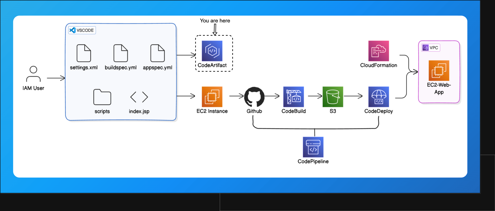

# End to End CI/CD Project with AWS

### **Complete Architecture**


---

## **1. Set Up a Web App in the Cloud**
### **Set up an IAM user:**
- It is a best practice to work with IAM user instead of working through Root user.
 
- Attach ***AdministratorAccess*** policy to the IAM user
- Now the work is only with IAM User, I am not going to work in Root user

### **Launch an EC2 Instance:**

- Give name to EC2 instance.
- Select AmazonAMI
- create-key pair
- save it in your PC
- Don't forget to change network access to MyIP in the Network settings.
- Click on create instance.

### **Connect to your EC2 Instance:**

- Using Public IPV4 DNS we can connect to EC2 instance using SSH
- Command connection
  -  ```
     ssh -i [XXXXXXX.pem] ec2-user@ec2-XX-XX-XX-XXX.ap-southeast-2.compute.amazonaws.com
     ```

 - Before the above make sure you have changes the permissions the .pem file
 ```
 icacls "nextwork-keypair.pem" /reset
 icacls "nextwork-keypair.pem" /grant:r "%USERNAME%:R"
 icacls "nextwork-keypair.pem" /inheritance:r
 ```
### **Install Apache Maven and Amazon Corretto 8:**
- Apache Maven Installation
 ```
  wget https://archive.apache.org/dist/maven/maven-3/3.5.2/binaries/apache-maven-3.5.2-bin.tar.gz

  sudo tar -xzf apache-maven-3.5.2-bin.tar.gz -C /opt

  echo "export PATH=/opt/apache-maven-3.5.2/bin:$PATH" >> ~/.bashrc

  source ~/.bashrc
 ```

- Java 8, or more specifically, Amazon Correto 8 Installation
```
 sudo dnf install -y java-1.8.0-amazon-corretto-devel

export JAVA_HOME=/usr/lib/jvm/java-1.8.0-amazon-corretto.x86_64

export PATH=/usr/lib/jvm/java-1.8.0-amazon-corretto.x86_64/jre/bin/:$PATH
```

### **Create the Application:**
- We've assembled both Maven and Java into our EC2 instance. Now let's cut straight to generating the web app!
- Use Maven to generate a java web app, to do this use the below commands
  - ```
     mvn archetype:generate \
      -DgroupId=com.webproject.app \
      -DartifactId=web-project \
      -DarchetypeArtifactId=maven-archetype-webapp \
      -DinteractiveMode=false
    ```
 - Watch out for a BUILD SUCCESS message in your terminal once your application is all set up.

### **Connect VSCode with your EC2 Instance:**
- Install an extension in VSCode.
- Use the extension to set up a connection between VSCode and your EC2 instance.
- Explore and edit your Java web app's files using VSCode.
- Succesfully connected and made changes to the code


---

## **2. Connect a GitHub Repo with AWS**


### **Install Git:**
- Commands to install git are given below
```
sudo dnf update -y
sudo dnf install git -y
```

- SignIn to GitHub account, if not there create account in GitHub.
- create a repository in GitHub


### **Commit and Push Your Changes to GithHub**
In this step, you're going to:
1. Set up a local git repo in your web app folder.
2. Connect your local repo with your GitHub repo.
3. Head back to your VSCode remote window. Make sure it's still SSH connected to your EC2 instance by checking the bottom left corner.
4. It is good practice to configure git before doing first commit
   
   ```
    git config --global user.name "Your Name"
    git config --global user.email you@nextwork.org
   ```

---

## **3. Dependencies and CodeArtifact**



### **💡What is AWS CodeArtifact?**
- Maven is going out to grab resources that live in the public internet to pull in your web app's packages - so imagine what might happen to your web app if these public resources suddenly become unavailable or    removed!In the real world, an outage of a dependency can completely break your CI/CD pipeline.
- Maven will fail to build your web app, so any testing and deploying of your latest updates are also forced to stop.This is where AWS CodeArtifact steps in.
- Think of AWS CodeArtifact as a private storage locker for you to keep a backup copy of all your web app's dependencies. Even if a dependency goes down in the public repository that it comes from, you can still   access your backup from CodeArtifact and continue building your app without any hiccups.
- You can imagine how CodeArtifact adds a layer of reliability and security, protecting your development process from external disruptions - super relevant to a DevOps role!

1. Choose Domains in the menu on the left, then Create domain.
2. Name your domain 'YOUR DOMAIN NAME'.
3. Choose Create domain.
4. Choose Create repository to create a repository for this new domain.
5. Name it.
6. For the description, let's add: Packages for the web app.
7. Select maven-central-store as the public upstream repository.

### **💡 What is the public upstream repository?**
- Your public upstream repository is not the same as the nextwork-packages repository that you're creating! First, take a look at the short description under "maven-central-store" - it provides artifacts from "Maven Central Repository". Let's break down how all these repositories are connected:
  1. Your local repository (i.e. your-packages)
  2. Public upstream repository (i.e. maven-central-store)
  3. Maven Central Repository
     
### **💡Why do we select maven-central-store?**
- We choose maven-central-store as our upstream repository because it’s connected to the biggest and most reliable library for Java packages (Maven Central Repository).
- We want to link it to our CodeArtifact to make sure CodeArtifact will make backups of the packages there

8. Click Next.
9. Click Create repository to finish the process.
10. On the next page, click View connection instructions. In the dialog, choose Mac & Linux for Operating system and mvn as package manager.
11. Copy the command in Step 3. This will look similar to the below:
    ```
     export CODEARTIFACT_AUTH_TOKEN=`aws codeartifact get-authorization-token --domain vishnu --domain-owner 339712919806 --region ap-southeast-2 --query authorizationToken --output text`
    ```
### **💡 What is this command for?** 
- "Export a CodeArtifact authorization token for authorization to your repository from your preferred shell."
- Sounds a little technical, but it's actually just like giving your VSCode IDE connected through remote-ssh a key to open your repositories in CodeArtifact.

12. Create settings.xml file in the web app.
13. Add the step 4,5,6 codes enclosed in ```<settings> * </settings>```, settings.xml file looks like as shown below.
```
<settings>
    <servers>
    <server>
        <id>vishnu-vishnu-packages</id>
        <username>aws</username>
        <password>${env.CODEARTIFACT_AUTH_TOKEN}</password>
    </server>
    </servers>

    <profiles>
    <profile>
        <id>vishnu-vishnu-packages</id>
        <activation>
        <activeByDefault>true</activeByDefault>
        </activation>
        <repositories>
        <repository>
            <id>vishnu-vishnu-packages</id>
            <url>https://vishnu-339712919806.d.codeartifact.ap-southeast-2.amazonaws.com/maven/vishnu-packages/</url>
        </repository>
        </repositories>
    </profile>
    </profiles>

    <mirrors>
    <mirror>
        <id>vishnu-vishnu-packages</id>
        <name>vishnu-vishnu-packages</name>
        <url>https://vishnu-339712919806.d.codeartifact.ap-southeast-2.amazonaws.com/maven/vishnu-packages/</url>
        <mirrorOf>*</mirrorOf>
    </mirror>
    </mirrors>

</settings>
```
14. Test Your CodeArtifact Connection via VSCode using the command shown below
    ```
    mvn -s settings.xml compile
    ```
### **Set up an IAM Policy for using CodeArtifact**
1. Click Policies in the left hand navigation panel.
2. Click Create policy.
3. Select the JSON tab
4. Use the policy code below (source: [Using Maven packages in CodeBuild](https://docs.aws.amazon.com/codeartifact/latest/ug/using-maven-packages-in-codebuild.html) ).
   
   ```
   {
    "Version": "2012-10-17",
    "Statement": [
        {
            "Effect": "Allow",
            "Action": [ "codeartifact:GetAuthorizationToken",
                        "codeartifact:GetRepositoryEndpoint",
                        "codeartifact:ReadFromRepository"
                        ],
            "Resource": "*"
        },
        {      
            "Effect": "Allow",
            "Action": "sts:GetServiceBearerToken",
            "Resource": "*",
            "Condition": {
                "StringEquals": {
                    "sts:AWSServiceName": "codeartifact.amazonaws.com"
                }
            }
        }
    ]
   }

   ```
5. Name the policy codeartifact-vishnu-consumer-policy.
6. For the description, let's add: Provides permissions to read from CodeArtifact.
7. Click Create policy.

---

## **Package an App with AWS CodeBuild**

### **Set up an S3 bucket**
### **💡 Why are we creating an S3 bucket?**
- This S3 bucket will later store a file that gets created in the build process you're about to set up. Let's create this bucket in advance so that CodeBuild is configured properly in the next step
  
### **💡Why are we compiling again with CodeBuild?**
- Didn't I compile something already with the settings.xml file?Good catch! The compiling that takes place in CodeBuild is exactly the same as the compiling you ran manually in the last step (when you ran mvn -s settings.xml compile). But, CodeBuild is going to help us automate that compilation process (so you won't need to run manual commands in your VSCode terminal to compile your web app anymore) AND it creates the WAR file for your server to run.

1. Click Create Bucket and give the bucket a unique name e.g. vishnu-build-artifacts-yourname.
2. Leave all the other options as default.
3. Click Create bucket.

## **Create a CodeBuild build project**
1. Log into the AWS Console and search for the CodeBuild console.
2. Select Create project.
3. Name the project vishnu-web-build.
4. Expand the Additional configuration toggle right underneath the Name field.
5. Add a tag with key team and value devops.
6. In the Source panel, select AWS CodeCommit as the source provider.

### **💡 What does source mean?**
- CodeBuild is ready to start compiling your web app, but it doesn't know where your code is stored! Source means the location of the code that CodeBuild will fetch, compile, and package into a WAR file. The source can be a version control repository, such as AWS CodeCommit, where your project's code is maintained and managed..
  
### **💡 There so many options for the source provider!**
- Yup, CodeCommit is not the only option for your project's source, so you can also use CodeBuild to automatically compile and build code stored in Amazon S3, GitHub, Bitbucket and other providers!

7. Select nextwork-web-project as the repository.
8. Select main as the branch.
   
