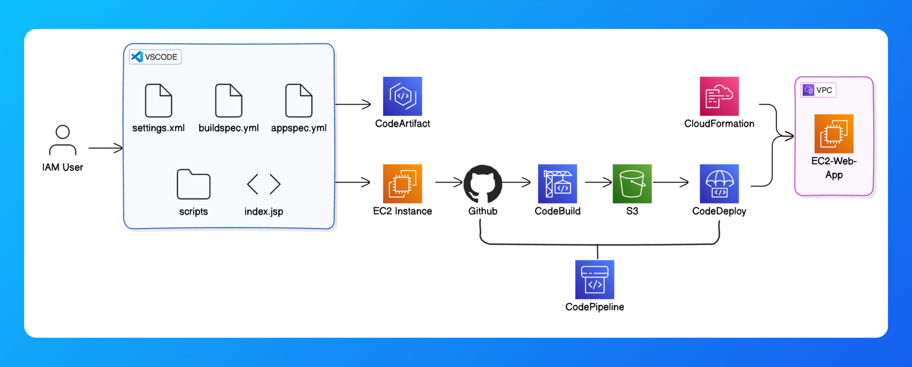

# End to End CI/CD Project with AWS

### **Complete Architecture**


---

## **1. Set Up a Web App in the Cloud**
### **Set up an IAM user:**
- It is a best practice to work with IAM user instead of working through Root user.
 
- Attach ***AdministratorAccess*** policy to the IAM user
- Now the work is only with IAM User, I am not going to work in Root user

### **Launch an EC2 Instance:**

- Give name to EC2 instance.
- Select AmazonAMI
- create-key pair
- save it in your PC
- Don't forget to change network access to MyIP in the Network settings.
- Click on create instance.

### **Connect to your EC2 Instance:**

- Using Public IPV4 DNS we can connect to EC2 instance using SSH
- Command connection
  -  ```
     ssh -i [XXXXXXX.pem] ec2-user@ec2-XX-XX-XX-XXX.ap-southeast-2.compute.amazonaws.com
     ```

 - Before the above make sure you have changes the permissions the .pem file
 ```
 icacls "nextwork-keypair.pem" /reset
 icacls "nextwork-keypair.pem" /grant:r "%USERNAME%:R"
 icacls "nextwork-keypair.pem" /inheritance:r
 ```
### **Install Apache Maven and Amazon Corretto 8:**
- Apache Maven Installation
 ```
  wget https://archive.apache.org/dist/maven/maven-3/3.5.2/binaries/apache-maven-3.5.2-bin.tar.gz

  sudo tar -xzf apache-maven-3.5.2-bin.tar.gz -C /opt

  echo "export PATH=/opt/apache-maven-3.5.2/bin:$PATH" >> ~/.bashrc

  source ~/.bashrc
 ```

- Java 8, or more specifically, Amazon Correto 8 Installation
```
 sudo dnf install -y java-1.8.0-amazon-corretto-devel

export JAVA_HOME=/usr/lib/jvm/java-1.8.0-amazon-corretto.x86_64

export PATH=/usr/lib/jvm/java-1.8.0-amazon-corretto.x86_64/jre/bin/:$PATH
```

### **Create the Application:**
- We've assembled both Maven and Java into our EC2 instance. Now let's cut straight to generating the web app!
- Use Maven to generate a java web app, to do this use the below commands
  - ```
     mvn archetype:generate \
      -DgroupId=com.webproject.app \
      -DartifactId=web-project \
      -DarchetypeArtifactId=maven-archetype-webapp \
      -DinteractiveMode=false
    ```
 - Watch out for a BUILD SUCCESS message in your terminal once your application is all set up.

### **Connect VSCode with your EC2 Instance:**
- Install an extension in VSCode.
- Use the extension to set up a connection between VSCode and your EC2 instance.
- Explore and edit your Java web app's files using VSCode.
- Succesfully connected and made changes to the code


---

## **2. Connect a GitHub Repo with AWS**

### **Install Git:**
- Commands to install git are given below
```
sudo dnf update -y
sudo dnf install git -y
```

- SignIn to GitHub account, if not there create account in GitHub.
- 
